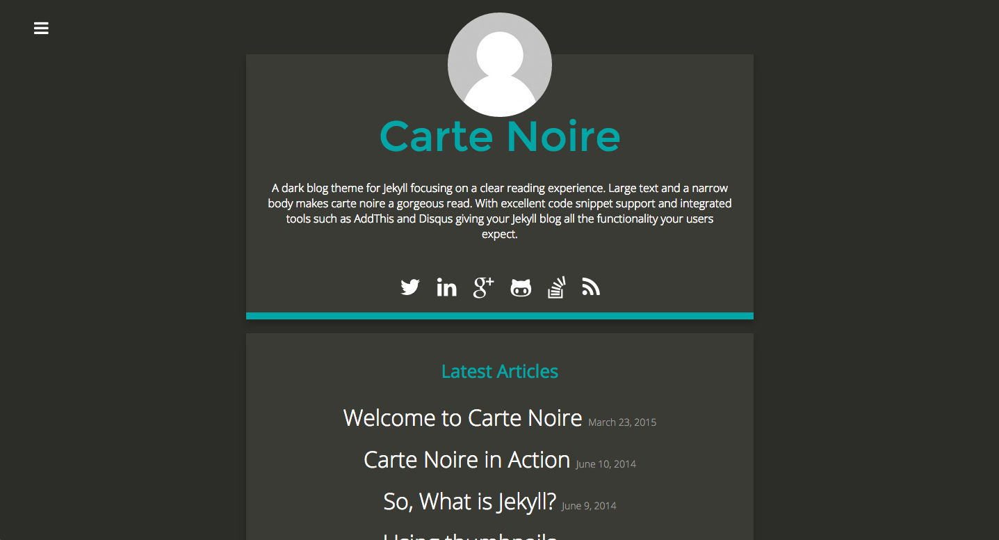
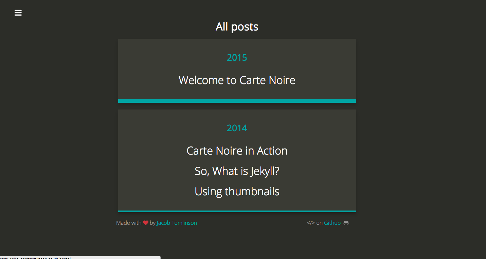
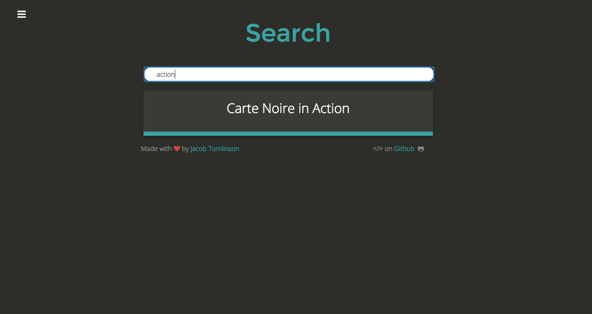
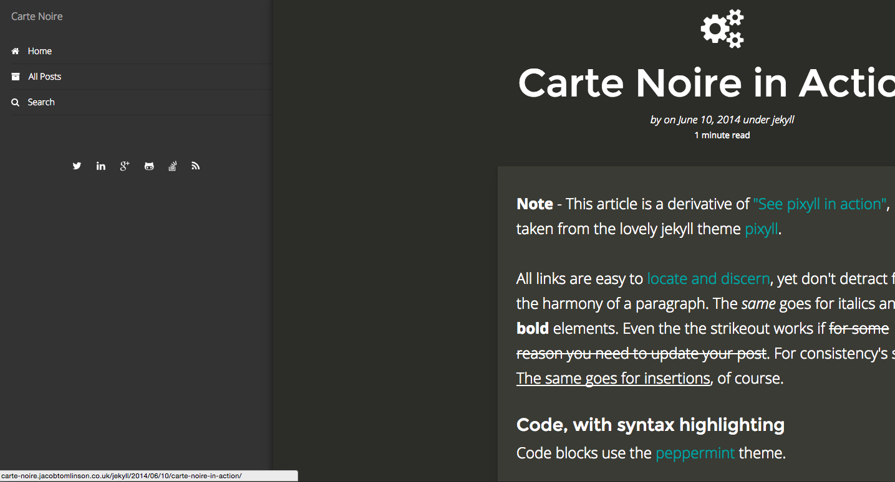

# Carte Noire

A simple Jekyll theme for blogging. Not named after the coffee.

### Article

### Posts grouped by year

### JavaScript Search

### Menu by mmenu

## Contact
If you wish to contact me regarding this theme please raise an issue on GitHub,
tweet me [@_jacobtomlinson](http://www.twitter.com/_jacobtomlinson) or email me
[jacob@jacobtomlinson.co.uk](mailto:jacob@jacobtomlinson.co.uk).

## Contribution
Pull requests are very welcome.

## Theme
This jekyll theme has been created from scratch. Ideas and inspiration are taken
from other places but the code is my own.

## Tools and Libraries
The following tools and libraries are used in this theme

### JavaScript
 * [HighlightJS](https://highlightjs.org/) (only on pages with code blocks)
 * [Simple Jekyll Search](https://github.com/christian-fei/Simple-Jekyll-Search) (search page only)
 * [MathJax](https://www.mathjax.org/) (only on pages using LaTeX)

### CSS
 * [Bootstrap](http://getbootstrap.com/)
 * [Font Awesome](http://fortawesome.github.io/Font-Awesome/)

## Dependency updates
Third-party assets (Font Awesome, HighlightJS, Simple Jekyll Search, MathJax,
Bootstrap and Google Fonts) are vendored locally so no external requests are
made at page load. A GitHub Actions workflow (`.github/workflows/update-dependencies.yml`)
runs weekly and opens a pull request whenever any of them can be updated. See
`scripts/update_dependencies.py` for the download logic.

The workflow also runs `npm run purge` (`scripts/purge-css.js`), which subsets
Bootstrap and Font Awesome CSS down to only the rules the site actually uses
(keeping the CSS files roughly 5–15 KB instead of 120+ KB).

### Other
 * [Real Favicon Generator](http://realfavicongenerator.net/)
 * [Google Analytics](http://www.google.com/analytics/)

## License
The jekyll theme, HTML, CSS and JavaScript is licensed under GPLv3 (unless stated otherwise in the file).
